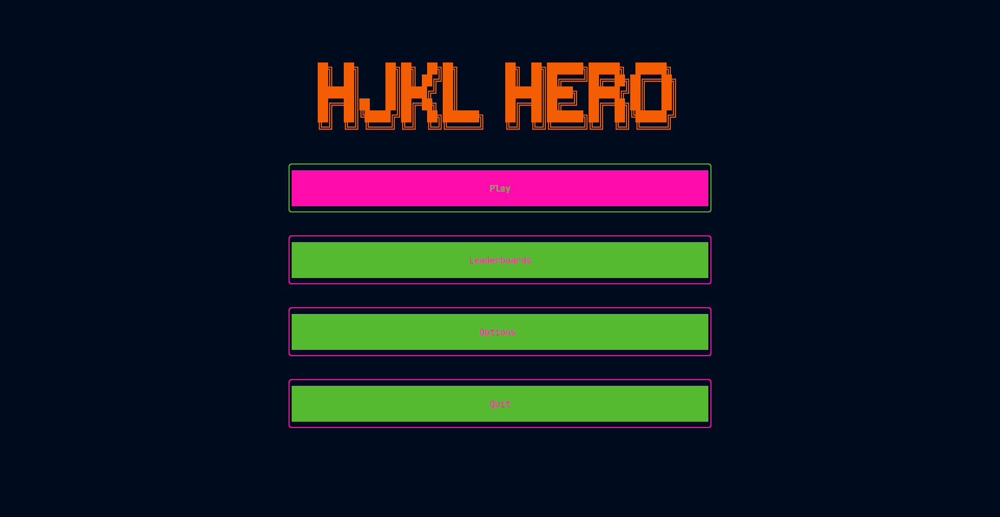
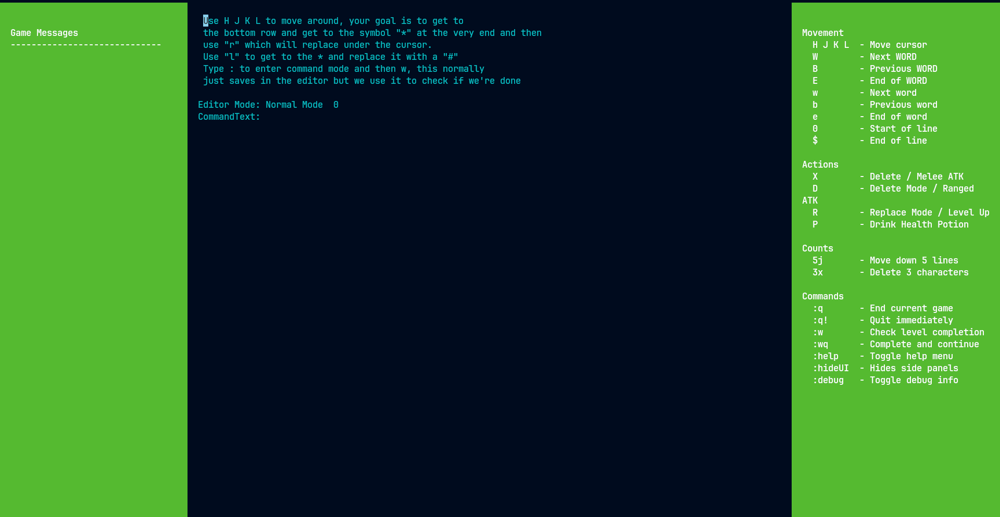
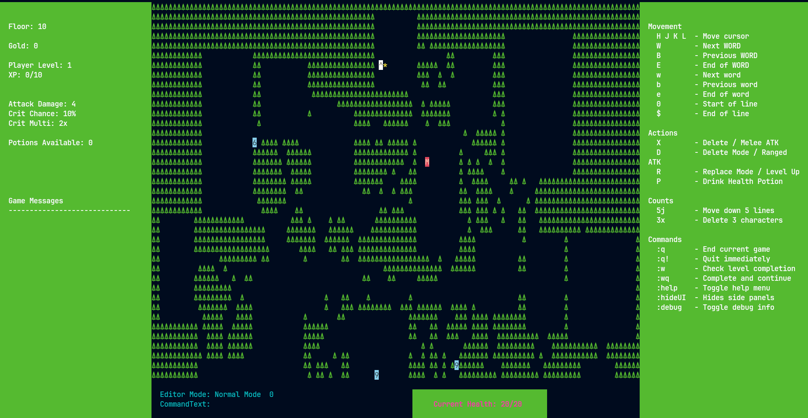

# HJKL Hero

A terminal based Vim motion game.

## Screenshots







## Motivation

I started playing around with Vim motions and saw there were games and tutorials but they were either too slow to get to the point or simply were too easy, so I thought
why not just get used to using them while making a game to hopefully help others?

## Terminal Recommendations
### Recommended Font

[JetBrains Mono](https://www.jetbrains.com/lp/mono/)

HJKL Hero is designed to be played in a terminal with Unicode support and a monospaced font. 
If the UI appears misaligned or borders don't line up correctly, try switching to a programming font. 
I develop and test the game using JetBrains Mono, so it is the recommended font.

## Features

- Learn Vim motions while having fun.
- Text editing tutorial levels.
- Procedurally generated dungeon levels.
- XP/Leveling system with a leaderboard to track stats.

## Installation
### For Users
Install the binary directly to your `GOBIN`:
```bash
go install github.com/BosBJJ/hjkl-hero@latest
```

### For Developers (Build from source)

```bash
git clone https://github.com/BosBJJ/hjkl-hero.git
cd hjkl-hero
go build -o hjkl-hero ./cmd/hjkl-hero 
```

## How To Play

### Tutorial Mode

Follow the instructions on the screen and use `:w` and `:wq` to verify map completion.

### Rogue Mode

Progress through bigger maps with more enemies on screen with each level, evade or kill enemies until you arrive to the `^` stairs, progress through
floors and upgrade your stats to make it easier to reach the end.

## Basic Controls

- `h j k l` - Move
- `x` - Delete character below cursor/attack enemy one tile away
- `d` + direction - Delete characters in specified direction/directional ranged attack
- `space` - Interact
- `:q!` - Quit out of the game
- `:help` Show all commands

## Current Game Modes

Switch through them by going to the `OPTIONS` screen and selecting `Game Type`

- Tutorial - Goes through currently written commands, gives a small playground to try them out on.
- Rogue - Use commonly used keys to kill monsters, progress through maps, gather loot and explore procedurally generated maps.

## Roadmap

- [ ] More tutorial maps/additional commands
- [ ] Items in rogue mode
- [ ] Character classes
- [ ] Endless mode - when finished you can restart while keeping some stats, increases difficulty
- [ ] Improve enemy pathing


## Contributing

### Submit a pull request

If you'd like to contribute, please fork the repository and open a pull request to the `main` branch.


## Acknowledgements

- [Bubble Tea](https://github.com/charmbracelet/bubbletea)
- [Lipgloss](https://github.com/charmbracelet/lipgloss)
- [kbraggins/duskhaven.nvim](https://github.com/kbraggins/duskhaven.nvim)
